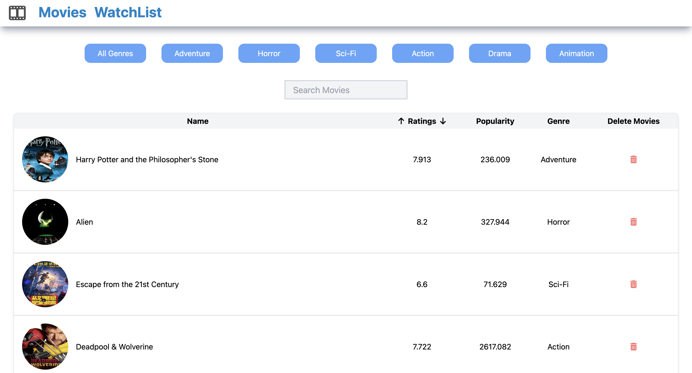

# TMDB Movies Project

This project utilizes **TMDB API** to populate trending movies, with features such as pagination, watchlist management, genre filtering, and more. It is built using **React**, and libraries such as **useContext**, **Redux Toolkit**, and **Tailwind CSS**.

## Features

### 1. **Trending Movies Pagination**
Populated trending movies dynamically from **TMDB API** with a pagination structure for seamless navigation.

### 2. **Watchlist Page**
Designed a watchlist page that allows users to manage their favorite movies. The page includes sortable tables to organize the movie list and improve user engagement.

### 3. **Genre Filtering and Search**
Implemented **genre filtering** and **search functionality**, enabling users to filter movies by genre and search for specific titles.

### 4. **State Management**
Utilized **useContext** and **Redux Toolkit** to manage the application's global state efficiently.

### 5. **Tailwind CSS for Styling**
Styled the application using **Tailwind CSS**, achieving a responsive and visually appealing UI.

## Technologies Used
- **React** for building the UI.
- **TMDB API** for fetching movie data.
- **useContext** and **Redux Toolkit** for state management.
- **Tailwind CSS** for styling.
- **Sortable tables**, **genre filtering**, and **search functionality** to enhance user experience.

---

## Deployed on Vercel
This project is deployed and accessible online through **Vercel**.

[Click here to view the deployed app](https://rehearsing-react.vercel.app/)